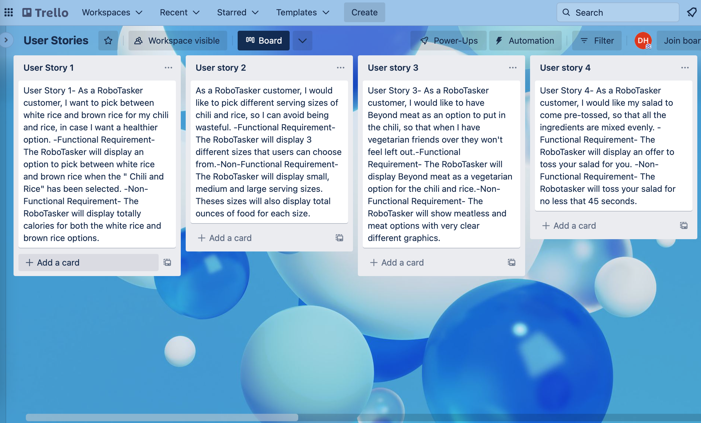
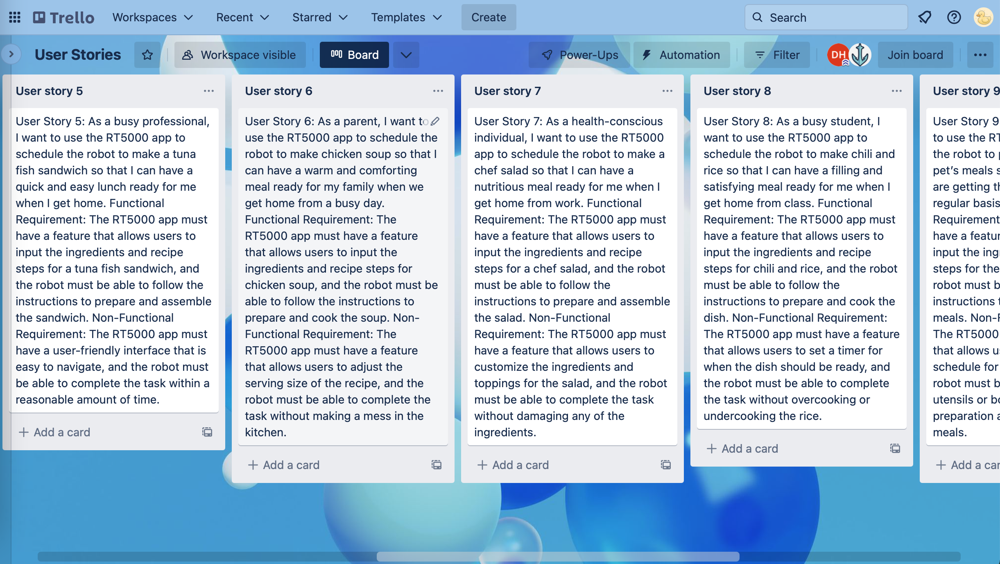
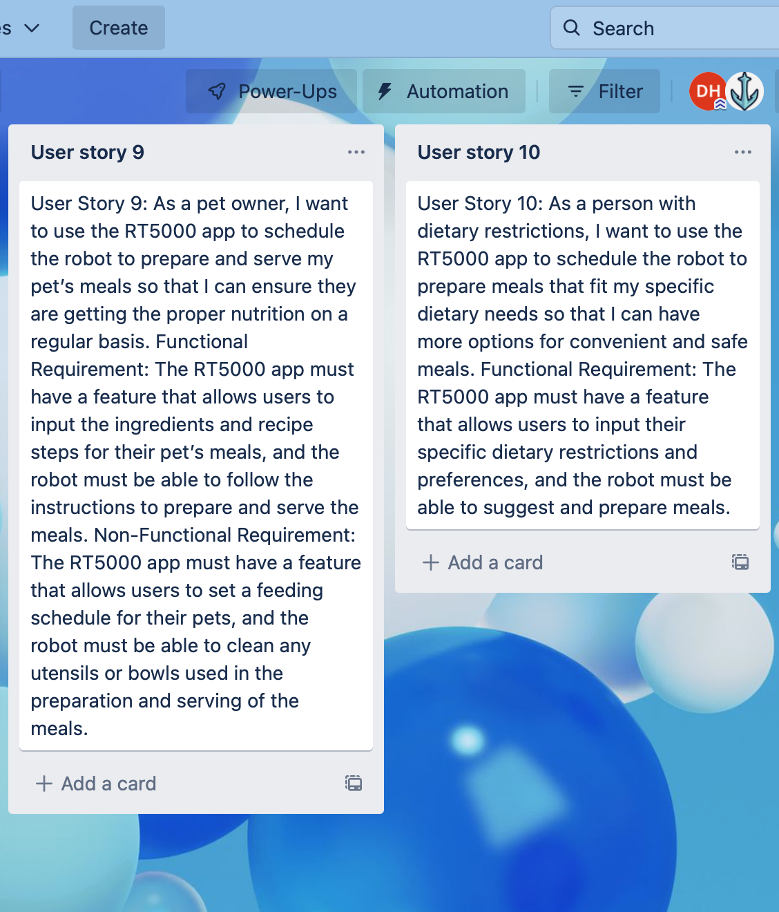

# RoboTasker
 Interview Questions
 
 ## Chili & Rice
 
1. What rice would you prefer, brown or white? 
2. Would you like the option to pick from multiple cuts of rice?
3. How spicy do you prefer your chili, not spicy, mild, medium, spicy, or very spicy? 
4. Would you like the option to pick from different protein sources in the chili, such as chicken, beef, ground turkey, or beyond meat? 
5. Would you like the option to pick different serving sizes of chili? 
6. Would you prefer your chili and rice mixed together or served separately?
7. At what temperature should the chili and rice be served?
8. Should the chili be served in a cup or a bowl?
9. If toppings for the chili were an option, what would be some of the toppings you would like to chose from? 
10. Should the chili and rice be served with a fork or a spoon? 

## Chef Salad 

1. A chef salad is generally made with lettuce, hard boiled eggs, cucumber, tomatoes, cheddar, swiss, ham, turkey, and croutons. Would you like the option to customize the salad?
2. Are there any toppings you feel are missing from the above recipe? 
3. Should there be multiple types of lettuce? 
4. Would you like the options to have toppings on the side of the salad?
5. How many different salad dressings should be available, what should those dressings be? 
6. Should you have the option to have the dressing on the side?
7. Should the salad come pre-tossed? 
8. Should there be different serving sizes of salads? 
9. Should there be a meatless options, like tofu? 
10. Should fat free dressing be offered? 

## Tuna Fish Sandwich

1. What ingredients are required to make a tuna fish sandwich? 
2. What is the process for preparing the tuna fish filling? 
3. How should the bread be prepared for the sandwich? 
4. Should the sandwich be toasted or not? 
5. What condiments are typically added to a tuna fish sandwich? 
6. How should the tuna fish filling be distributed on the bread?
7. Should any additional toppings be added to the sandwich?
8. How should the sandwich be cut and presented? 
9. Is there a preferred temperature at which the sandwich should be served?
10. How long should the robot take to prepare a tuna fish sandwich from start to finish?

## Chicken Noodle Soup

1. What ingredients are required to make chicken soup? 
2. What is the process for preparing the chicken for the soup?
3. What vegetables are typically added to chicken soup? 
4. How should the vegetables be prepared for the soup? 
5. What spices and herbs are typically added to chicken soup?
6. Should the chicken be shredded or left in larger pieces for the soup?
7. Should noodles or other starches be added to the soup? 
8. How should the soup be presented and served?
9. Is there a preferred temperature at which the soup should be served? 
10. How long should the robot take to prepare a bowl of chicken soup from start to finish?

## Top 10 Requirements

1. Recipe Selection: The user should be able to easily select one of the four pre-installed recipes from the app's main menu. 
2. Parameter Customization: The user should be able to input customized parameters for the selected recipe, such as the quantity of ingredients or the scheduled start time. 
3. Task Progress: The user should be able to see the progress of the robot's task in real-time, with a clear indication of how much of the task has been completed and how much is left.
4. Task Completion Notification: The app should notify the user when the robot has completed its task, both audibly and visually. 
5. Error Handling: The app should provide clear error messages and guidance if the robot encounters an issue while performing its task. 
6. Pause/Resume Functionality: The user should be able to pause and resume the robot's task at any time. 
7. App Compatibility: The app should be compatible with multiple devices and operating systems, to ensure a wide range of users can access it. 
8. Recipe Editing: The user should be able to edit and save their own customized recipes within the app. 
9. Multiple Task Management: The user should be able to manage and schedule multiple tasks at once, with clear indications of which task is currently in progress. 
10. User Profile Management: The app should allow the user to create and manage their own profile, with features such as saved recipes and task history.

